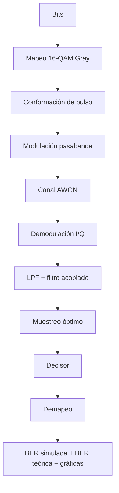

# Proyecto 16-QAM Gray sobre Canal AWGN en MATLAB

Este repositorio contiene la simulación en MATLAB de un sistema de comunicaciones digitales basado en **16-QAM con mapeo Gray** sobre un **canal AWGN**. El proyecto implementa una cadena completa de transmisión y recepción, desde la generación de bits hasta el cálculo de la BER simulada y teórica, incluyendo gráficas de validación.

---

## Descripción general

El sistema simulado implementa una cadena completa de comunicaciones digitales:

- Generación de bits.
- Mapeo 16-QAM Gray.
- Conformación de pulso.
- Modulación pasabanda.
- Canal AWGN.
- Demodulación I/Q.
- Filtro pasabajas y filtro acoplado.
- Muestreo óptimo.
- Decisor.
- Demapeo.
- Cálculo de BER simulada y BER teórica.
- Visualización de resultados.

El objetivo principal es evaluar el desempeño de una modulación digital **16-QAM Gray** en presencia de ruido AWGN, comparando la **BER simulada** con la **BER teórica** para diferentes valores de \(E_b/N_0\).

---

## Arquitectura general del sistema



---

## Relación entre bloques y archivos MATLAB

| Bloque | Archivo principal | Función dentro del sistema |
|---|---|---|
| Bits | `transmitter/generate_bits.m` | Genera la secuencia binaria de entrada. |
| Mapeo 16-QAM Gray | `transmitter/map_16qam_gray.m` | Agrupa bits y los convierte en símbolos complejos 16-QAM. |
| Conformación de pulso | `transmitter/modulate_passband_16qam.m` | Convierte símbolos discretos en una señal continua mediante pulso de transmisión. |
| Modulación pasabanda | `transmitter/modulate_passband_16qam.m` | Traslada la señal de banda base a pasabanda usando ramas I/Q. |
| Canal AWGN | `channel/add_awgn_real_passband.m` | Agrega ruido gaussiano blanco aditivo a la señal transmitida. |
| Demodulación I/Q | `receiver/demodulate_passband_16qam.m` | Recupera las componentes en fase y cuadratura. |
| LPF + filtro acoplado | `receiver/demodulate_passband_16qam.m` | Filtra la señal y aplica el filtro acoplado para el muestreo. |
| Muestreo óptimo | `receiver/demodulate_passband_16qam.m` | Toma muestras en los instantes adecuados de símbolo. |
| Decisor | `receiver/demap_16qam_gray.m` | Clasifica cada muestra recibida en el nivel más cercano. |
| Demapeo | `receiver/demap_16qam_gray.m` | Convierte símbolos estimados nuevamente en bits. |
| BER simulada | `receiver/compute_ber.m` | Compara bits transmitidos y recibidos. |
| BER teórica | `receiver/ber_theory_16qam_gray_approx.m` | Calcula la referencia teórica aproximada. |
| Gráficas | `visualization/` | Genera BER, constelación, diagrama de ojo y espectro. |

---

## Características principales

- Simulación de modulación **16-QAM Gray**.
- Canal **AWGN**.
- Modulación pasabanda.
- Demodulación coherente I/Q.
- Conformación de pulso.
- Filtro pasabajas.
- Filtro acoplado.
- Muestreo óptimo.
- Decisor por regiones de decisión.
- Cálculo de BER simulada.
- Cálculo de BER teórica aproximada.
- Gráficas de:
  - BER vs \(E_b/N_0\)
  - Constelación recibida
  - Diagrama de ojo
  - Espectro de la señal
- Código organizado de forma modular.
- Implementación manual sin usar funciones automáticas de modulación/demodulación.

---

## Estructura del proyecto

```text
proyecto_16qam_awgn/
│
├── channel/
│   └── add_awgn_real_passband.m
│
├── receiver/
│   ├── ber_theory_16qam_gray_approx.m
│   ├── compute_ber.m
│   ├── demap_16qam_gray.m
│   └── demodulate_passband_16qam.m
│
├── resources/
│
├── transmitter/
│   ├── generate_bits.m
│   ├── map_16qam_gray.m
│   └── modulate_passband_16qam.m
│
├── visualization/
│   ├── plot_ber_curves.m
│   ├── plot_constellation.m
│   ├── plot_eye_diagram.m
│   └── plot_spectrum.m
│
├── main.m
├── params.m
└── Proyecto_16qam_awgn.prj
```

---

## Archivos principales

| Archivo | Descripción |
|---|---|
| `main.m` | Ejecuta la simulación completa. |
| `params.m` | Define los parámetros principales del sistema. |
| `generate_bits.m` | Genera la secuencia binaria de entrada. |
| `map_16qam_gray.m` | Realiza el mapeo Gray de bits a símbolos 16-QAM. |
| `modulate_passband_16qam.m` | Implementa la conformación de pulso y la modulación pasabanda. |
| `add_awgn_real_passband.m` | Agrega ruido AWGN a la señal transmitida. |
| `demodulate_passband_16qam.m` | Realiza la demodulación I/Q, filtrado y muestreo. |
| `demap_16qam_gray.m` | Convierte los símbolos recibidos nuevamente en bits. |
| `compute_ber.m` | Calcula la BER simulada. |
| `ber_theory_16qam_gray_approx.m` | Calcula la BER teórica aproximada para 16-QAM Gray. |
| `plot_ber_curves.m` | Grafica BER simulada y BER teórica. |
| `plot_constellation.m` | Grafica la constelación recibida. |
| `plot_eye_diagram.m` | Genera el diagrama de ojo. |
| `plot_spectrum.m` | Grafica el espectro de la señal. |

---

## Parámetros principales

Los parámetros del sistema se definen en `params.m`.

| Parámetro | Descripción |
|---|---|
| `M = 16` | Número de símbolos de la constelación. |
| `k = log2(M)` | Bits por símbolo. Para 16-QAM, `k = 4`. |
| `Es = 1` | Energía promedio de símbolo normalizada. |
| `Eb = Es/k` | Energía por bit. |
| `Rb` | Tasa de bits. |
| `Rs = Rb/log2(M)` | Tasa de símbolos. |
| `Ts = 1/Rs` | Periodo de símbolo. |
| `sps` | Muestras por símbolo. |
| `Fs = sps*Rs` | Frecuencia de muestreo. |
| `fc = 4*Rs` | Frecuencia portadora usada en la simulación. |
| `alpha` | Factor de roll-off del pulso. |
| `pulseSpanSymbols` | Duración del pulso expresada en símbolos. |
| `eyeTraces` | Número de trazas usadas en el diagrama de ojo. |
| `constellationPointsToShow` | Número de puntos mostrados en la constelación. |
| `rngSeed` | Semilla para reproducibilidad. |

---

## Parámetros calculados

Para la simulación se usan las siguientes relaciones:

```text
k = log2(M)
k = log2(16) = 4 bits/símbolo
```

```text
Rs = Rb/log2(M)
Rs = 4000/4 = 1000 símbolos/s
```

```text
Ts = 1/Rs
Ts = 1/1000 = 0.001 s = 1 ms
```

```text
Fs = sps · Rs
Fs = 16 · 1000 = 16000 Hz
```

```text
Eb = Es/log2(M)
Eb = 1/4 = 0.25
```

```text
fc = 4Rs
fc = 4 · 1000 = 4000 Hz
```

> **Nota:** `fc = 4Rs` es una decisión de simulación para ubicar la señal en pasabanda. No es una regla teórica obligatoria.

---

## Mapeo 16-QAM Gray

La modulación 16-QAM se implementa como el producto de dos modulaciones 4-PAM:

```text
16-QAM = 4-PAM en I × 4-PAM en Q
```

Los niveles usados por dimensión son:

```text
I, Q ∈ {-3, -1, 1, 3}
```

El símbolo complejo se define como:

```text
s = I + jQ
```

El mapeo Gray por dimensión es:

```text
00 → -3
01 → -1
11 →  1
10 →  3
```

Este mapeo permite que símbolos vecinos difieran en un solo bit, reduciendo la cantidad de errores de bit cuando ocurre una decisión hacia un símbolo adyacente.

---

## Normalización de la constelación

La constelación se normaliza para trabajar con energía promedio de símbolo unitaria.

Primero se calcula la energía promedio por dimensión:

```text
E[I²] = [(-3)² + (-1)² + 1² + 3²] / 4
```

```text
E[I²] = (9 + 1 + 1 + 9) / 4 = 5
```

Como la constelación tiene dos ramas:

```text
Es = E[I²] + E[Q²]
Es = 5 + 5 = 10
```

Para obtener `Es = 1`, se usa un factor de escala `a`:

```text
s_norm = a(I + jQ)
Es_norm = a² Es
1 = a² · 10
a = 1/sqrt(10)
```

Por tanto:

```text
s_norm = (I + jQ)/sqrt(10)
```

En el código esto aparece como:

```matlab
p.constellationScale = 1/sqrt(10);
```

La normalización no cambia el mapeo Gray ni la geometría relativa de la constelación. Solo cambia la escala para trabajar con `Es = 1`.

---

## Conformación de pulso

Después del mapeo, los símbolos discretos deben convertirse en una forma de onda continua. Esto se realiza mediante conformación de pulso:

```text
x(t) = Σ s_n p(t - nT)
```

En el proyecto se usa un pulso raíz de coseno alzado implementado manualmente.

La relación con el filtro acoplado se expresa como:

```text
g(t) = p(t) * p(-t)
```

donde:

- `p(t)` es el pulso transmisor.
- `p(-t)` es el filtro acoplado.
- `g(t)` es la respuesta equivalente.

La condición de Nyquist busca que:

```text
g(kT) = δ[k]
```

Esto permite reducir la interferencia entre símbolos en los instantes de muestreo.

---

## Modulación pasabanda

La modulación pasabanda transforma la señal de banda base en una señal real centrada alrededor de una frecuencia portadora.

La señal transmitida se construye con dos ramas:

- Rama en fase `I`.
- Rama en cuadratura `Q`.

La expresión usada es:

```text
x_c(t) = sqrt(2) s_I(t) cos(2πf_c t) - sqrt(2) s_Q(t) sin(2πf_c t)
```

La componente `I` modula un coseno y la componente `Q` modula un seno con signo negativo. Así se obtiene una señal real pasabanda a partir de símbolos complejos.

---

## Canal AWGN

El canal se modela como:

```text
y = x + noise
```

o en su forma discreta equivalente:

```text
Y_n = S_n + Z_n
```

El ruido se calcula a partir de \(E_b/N_0\):

```text
EbN0_lineal = 10^(EbN0_dB/10)
Eb = Es/log2(M)
N0 = Eb/EbN0_lineal
sigma² = N0/2
```

En el código, la señal transmitida se representa como `txPassband` y la señal recibida como `rxPassband`.

---

## Receptor

El receptor realiza la operación inversa al transmisor. Las etapas principales son:

```text
Demodulación I/Q
 ↓
Filtro pasabajas
 ↓
Filtro acoplado
 ↓
Compensación de retardo
 ↓
Muestreo óptimo
 ↓
Reconstrucción del símbolo complejo
```

Las mezclas I/Q se realizan mediante:

```text
mixedI = sqrt(2)y cos(2πf_c t)
mixedQ = -sqrt(2)y sin(2πf_c t)
```

Después de filtrar y compensar retardos, se toman muestras en los instantes de símbolo:

```text
t = nT
```

Si no se compensa correctamente el retardo de los filtros, la BER puede quedar cerca de `0.5`, porque el receptor estaría tomando muestras en instantes incorrectos.

---

## Decisor y demapeo

El decisor clasifica cada muestra recibida en el nivel más cercano de la constelación.

Los niveles no normalizados por dimensión son:

```text
-3, -1, 1, 3
```

Por eso los umbrales de decisión son:

```text
-2, 0, 2
```

Las reglas por dimensión son:

```text
x < -2        → 00
-2 ≤ x < 0    → 01
0 ≤ x < 2     → 11
x ≥ 2         → 10
```

El demapeo convierte los símbolos estimados nuevamente en bits.

---

## BER

La BER simulada se calcula comparando los bits transmitidos y recibidos:

```matlab
bitErrors = sum(bitsTx ~= bitsRx);
ber = bitErrors / length(bitsTx);
```

También puede expresarse como:

```text
BER_sim = bits errados / bits transmitidos
```

La BER teórica se usa como referencia analítica para comparar el comportamiento de la simulación.

En valores altos de \(E_b/N_0\), la BER simulada puede dar cero si durante la simulación no aparece ningún error. Esto no significa que el error sea imposible, sino que la simulación usa un número finito de bits.

---

## Gráficas generadas

El proyecto genera las siguientes gráficas de validación.

### 1. BER vs Eb/N0

Permite comparar la BER simulada con la BER teórica.

Conclusión esperada:

```text
Si Eb/N0 aumenta, la BER debe disminuir.
```

Esto indica que, al aumentar la energía por bit respecto al ruido, el receptor comete menos errores.

---

### 2. Constelación recibida

Muestra las muestras recibidas antes del decisor.

Conclusión esperada:

```text
Para 16-QAM deben observarse 16 agrupamientos alrededor de los puntos ideales.
```

Si aumenta el ruido, los puntos se dispersan. Si aumenta \(E_b/N_0\), los puntos se concentran mejor alrededor de los símbolos ideales.

---

### 3. Diagrama de ojo

Permite observar la calidad temporal de la señal y el instante de muestreo.

Conclusión esperada:

```text
En 16-QAM el ojo es multinivel, no binario simple.
```

Un ojo abierto indica mejores condiciones para muestrear. Un ojo cerrado puede indicar ruido, interferencia o problemas de sincronización.

---

### 4. Espectro

Permite verificar que la señal fue trasladada a pasabanda.

Conclusión esperada:

```text
El espectro debe aparecer alrededor de +fc y -fc.
```

Esto valida la etapa de modulación pasabanda.

---

## Ancho de banda

El ancho de banda se relaciona con la tasa de bits, el número de bits por símbolo y el factor de roll-off:

```text
B = Rb(1 + alpha)/(2log2(M))
```

```text
W = Rb(1 + alpha)/log2(M)
```

Para:

```text
Rb = 4000 bit/s
M = 16
alpha = 0.5
```

se obtiene:

```text
B = 750 Hz
W = 1500 Hz
```

La banda positiva queda aproximadamente en:

```text
[fc - W/2, fc + W/2] = [3250, 4750] Hz
```

La banda negativa queda aproximadamente en:

```text
[-fc - W/2, -fc + W/2] = [-4750, -3250] Hz
```

---

## Cómo ejecutar el proyecto

1. Abrir MATLAB.
2. Abrir la carpeta del proyecto.
3. Ejecutar el archivo principal:

```matlab
main
```

También puede abrirse el archivo:

```text
Proyecto_16qam_awgn.prj
```

si se desea trabajar desde el entorno de proyecto de MATLAB.

---

## Requisitos

- MATLAB.

No se requiere el uso de funciones automáticas como:

- `qammod`
- `qamdemod`
- `pskmod`
- `pskdemod`
- `rcosdesign`
- `eyediagram`

La implementación está desarrollada manualmente para cumplir con los requerimientos académicos del proyecto.

---

## Validación del sistema

El sistema se valida mediante:

- Disminución de BER al aumentar \(E_b/N_0\).
- Comparación entre BER simulada y BER teórica.
- Formación de 16 clústeres en la constelación recibida.
- Diagrama de ojo coherente con una señal multinivel.
- Espectro ubicado alrededor de la frecuencia portadora.
- Organización modular del código.
- Reproducibilidad mediante semilla aleatoria.

---

## Ideas clave para sustentación

- 16-QAM es una modulación bidimensional porque usa una rama `I` y una rama `Q`.
- Cada símbolo representa `log2(16) = 4` bits.
- El mapeo Gray no normaliza la constelación; solo organiza las etiquetas binarias.
- El factor `1/sqrt(10)` sale de normalizar la energía promedio de símbolo a `Es = 1`.
- `fc = 4Rs` es una decisión de simulación, no una regla teórica obligatoria.
- Si la BER simulada y teórica bajan al aumentar \(E_b/N_0\), el sistema se comporta como se espera.
- Si la BER queda cerca de `0.5`, se deben revisar sincronización, retardo, muestreo, demodulación y decisión.
- La constelación, el diagrama de ojo y el espectro son evidencias visuales del funcionamiento del sistema.

---

## Conclusión

El proyecto implementa una cadena completa de comunicaciones digitales 16-QAM Gray sobre canal AWGN. La simulación permite analizar el comportamiento del sistema frente al ruido, validar el desempeño mediante BER y estudiar visualmente la señal mediante constelación, diagrama de ojo y espectro.

La estructura modular del código facilita la comprensión, sustentación y modificación de cada bloque del sistema, conectando la teoría de modulación digital con una implementación práctica en MATLAB.

---

## Autor

Proyecto desarrollado para el curso de **Comunicaciones Digitales**.

**Estudiante:** Sara Duque, Nicolas Sanchez, Gabriel Aroca  
**Software:** MATLAB  
**Tema:** Modulación digital  
